# Balloon Bouncer — promo kit

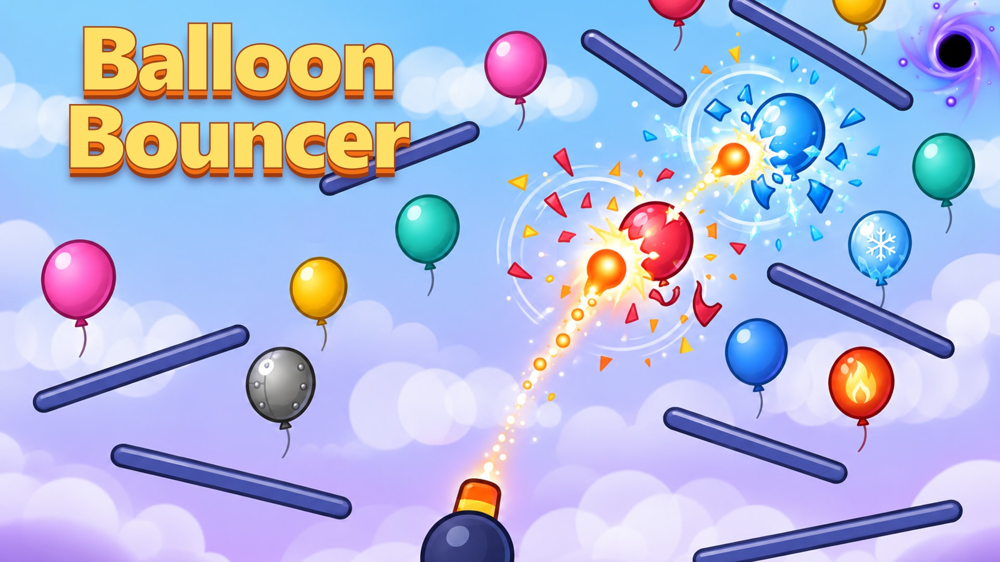

**Fling once. Watch everything pop.**

[▶ Play Balloon Bouncer](https://libodev.github.io/BalloonBouncer2D/) · [Source and setup](README.md)

Line up your shot, pull back, and let your balls bounce through a field of balloons and rails. Every pop earns coins. Clear at least 75% of the field, then build a stronger launch with saw blades, fireballs, lightning orbs, and black holes. New balloon types add tougher targets and explosive chain reactions as you progress.

## Gameplay preview

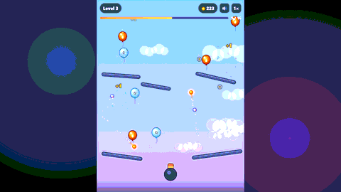

Watch or download the 12-second gameplay videos: [landscape MP4](marketing/dist/previews/gameplay-landscape-1920x1080.mp4) · [portrait MP4](marketing/dist/previews/gameplay-portrait-1080x1920.mp4). The previews show real gameplay and are silent.

## Gameplay screenshots

| First bounce | Fireball |
| :---: | :---: |
| 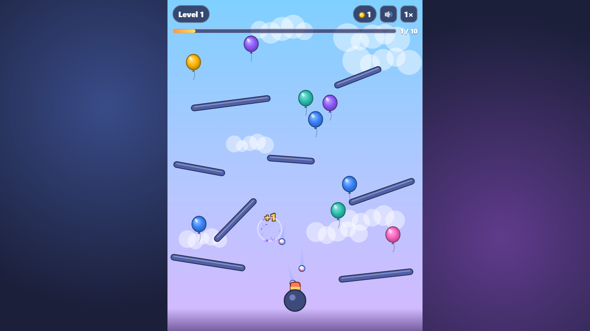 | 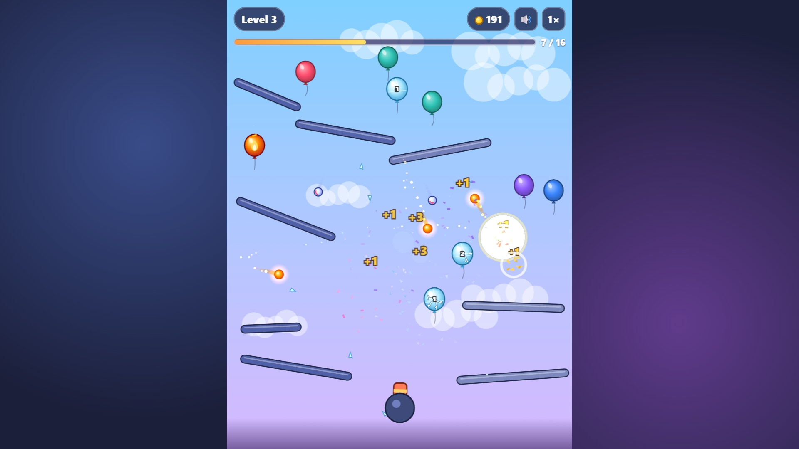 |

| Lightning orb | Black hole |
| :---: | :---: |
| 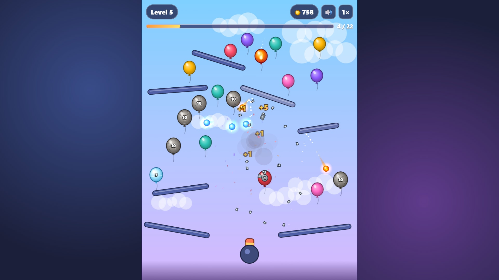 | 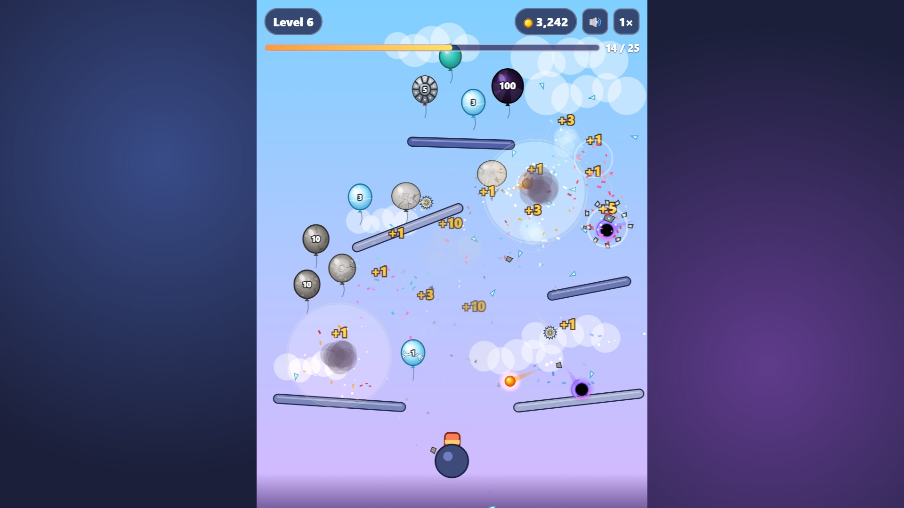 |

| Level results | Upgrade shop |
| :---: | :---: |
| 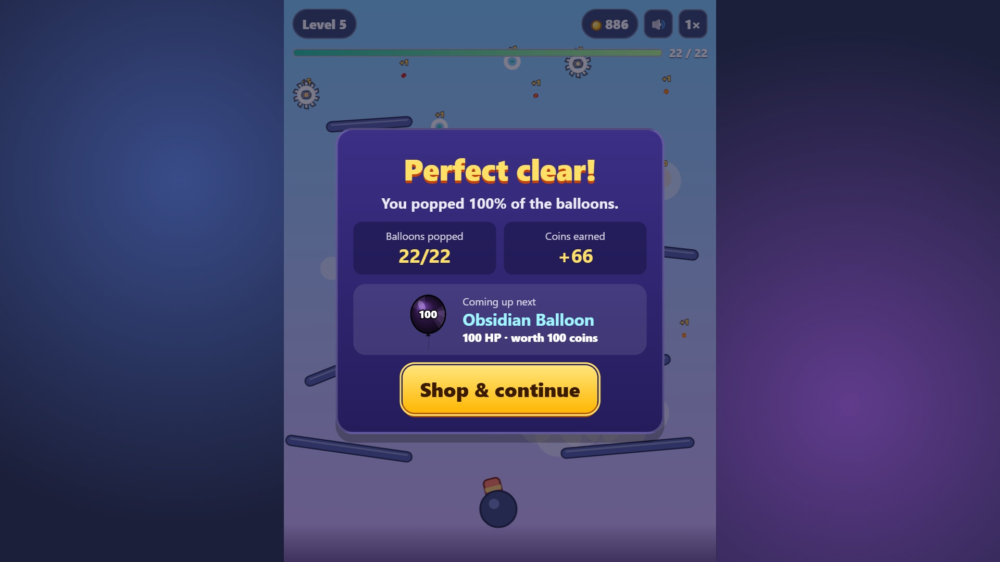 | 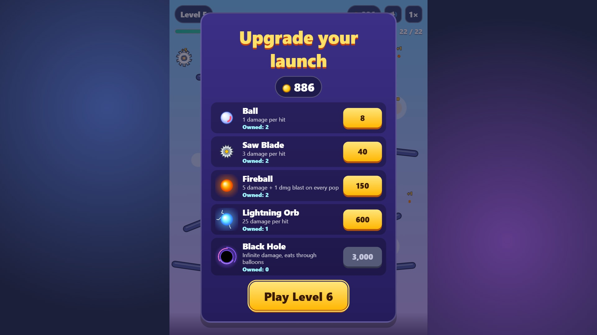 |

## Cover art and banners

| Wide banner | Square cover | Portrait cover |
| :---: | :---: | :---: |
| [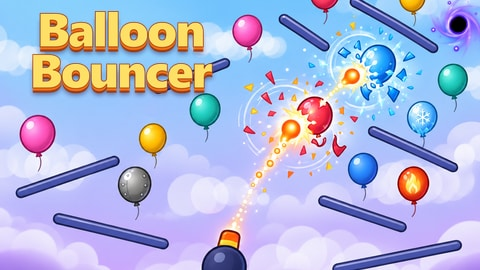](marketing/dist/cover-art/with-logo/banner-16x9-1920x1080.jpg) | [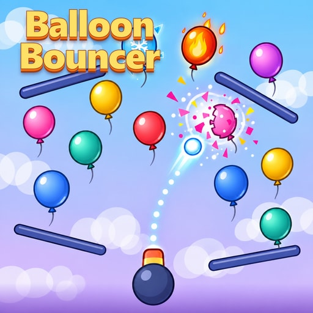](marketing/dist/cover-art/with-logo/square-1x1-1080.jpg) | [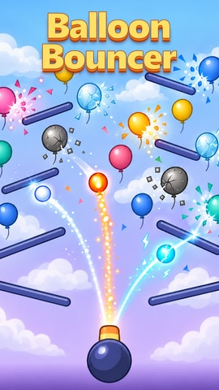](marketing/dist/cover-art/with-logo/banner-9x16-1080x1920.jpg) |

Cover art is promotional illustration. The screenshots and gameplay previews above are captures from the game.

The [finished asset folder](marketing/dist/) includes more banner sizes, icons, transparent logos, phone and tablet screenshots, and video formats. See [the kit guide](marketing/README.md) and [promotional copy](marketing/copy.md) for additional material.
